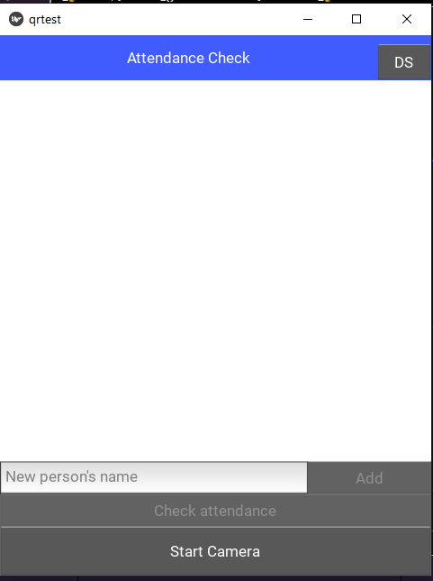

# Attendance check application using Face recognition
  
# Môn học: CS406.O11- Xử lý ảnh và ứng dụng

## Thành viên thực hiện: 
- Trần Nhật Phong - 21521276
- Lê Tuấn Vũ - 21521679 
- Bùi Nguyễn Anh Trung - 20520332

## Get app to work on PC
### Make sure to have python and pip install
1. Git clone this repository:
> git clone https://github.com/phongidoit/Final-Project-_kivy
2. Open Command Prompt in downloaded directory
3. Run this line in command prompt to install nessesary library 
> pip install -r requirements.txt
4. Run main.py

## Android device installation  
To be updated

### Application should display as follow
